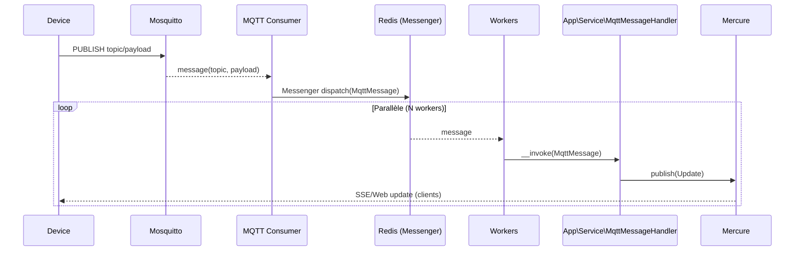

# Dataviz — Architecture d'infrastructure

Ce document résume l’architecture mise en place pour l’ingestion d’évènements MQTT, leur traitement asynchrone via Symfony Messenger, et la diffusion en temps réel via Mercure.

## Vue d’ensemble

- Broker MQTT (Mosquitto) pour la réception des messages IoT.
- Bridge MQTT (conteneur dédié) qui contient:
  - Un consommateur MQTT natif PHP (php-mqtt/client) long-vivant.
  - Plusieurs workers Messenger (`messenger:consume`) supervisés pour le traitement asynchrone.
  - Supervisor pour gérer et relancer les processus.
- Symfony (application): logique métier, handlers, publication vers Mercure.
- Redis: transport par défaut de Messenger (file `messages`).
- PostgreSQL: base applicative et transport d’échec (`failed`) de Messenger.
- Mercure: diffusion des mises à jour temps réel vers le front.

## Schéma (composants)

```mermaid
flowchart LR
  subgraph Edge[IoT / Edge]
    D[Devices]
  end

  D -- MQTT publish --> MQ[MQTT Broker (Mosquitto)]

  subgraph Bridge[Bridge MQTT]
    direction TB
    C[PHP MQTT Consumer\n(php-mqtt/client)]
    W1[Messenger Worker #1]
    Wn[Messenger Workers (N)]
    SUP[Supervisor]
    SUP -. supervise .-> C
    SUP -. supervise .-> W1
    SUP -. supervise .-> Wn
  end

  subgraph Backend[Symfony App]
    SVC[MqttMessageHandler\n(Service)]
    MERC[Mercure Publisher]
  end

  MQ --> C
  C -- dispatch --> RED[(Redis\nMessenger transport)]
  RED --> W1
  RED --> Wn
  W1 --> SVC
  Wn --> SVC
  SVC --> MERC
  MERC --> F[Front Web]

  subgraph Data
    PG[(PostgreSQL)]
  end

  W1 -. erreurs .-> PG
  Wn -. erreurs .-> PG
```

## Schéma (séquence d’un message)



## Déploiement & conteneurs

- `database` (PostgreSQL): variables `POSTGRES_DB`, `POSTGRES_USER`, `POSTGRES_PASSWORD`, volume `database_data`.
- `redis`: Redis 7 avec AOF activé (`--appendonly yes`), volume `redis_data`.
- `mqtt`: Mosquitto (broker), volumes `mosquitto_data`, `mosquitto_log`.
- `mqtt-bridge`:
  - Démarre `php /app/bin/mqtt-consumer.php` (consommateur MQTT natif).
  - Démarre `messenger:consume async` en plusieurs exemplaires (`WORKER_COUNT`).
  - Extensions PHP: `pdo_pgsql`, `redis`.
  - Lit sa config via variables d’environnement (voir ci-dessous).
- `mercure`: hub pour la diffusion temps réel.

## Configuration (env)

- MQTT (bridge): `MQTT_HOST`, `MQTT_PORT`, `MQTT_USERNAME`, `MQTT_PASSWORD`, `MQTT_TOPICS` (séparés par virgule ou espace), `MQTT_QOS`, `MQTT_TLS`, `MQTT_CLIENT_ID`.
- Messenger: `MESSENGER_TRANSPORT_DSN=redis://redis:6379/messages`.
- Base de données: `DATABASE_URL` (dans l’app), et `DATABASE_URL` injecté au bridge pour les workers (doctrine / transport failed).
- Workers (bridge): `WORKER_COUNT`, `CONSUME_TRANSPORTS` (défaut `async`), `CONSUMER_OPTIONS`.

## Logs

- Canal dédié `mqtt` (Monolog):
  - Dev: `var/log/mqtt.log` (séparé de `var/log/dev.log`).
  - Prod: sortie `stderr` (JSON) pour intégration dans les pipelines de logs.
- Services taggés `mqtt`: `App\Mqtt\MqttConsumer`, `App\Service\MqttMessageHandler`.

## Scalabilité & résilience

- Le bridge exécute plusieurs workers Messenger en parallèle (`WORKER_COUNT`).
- Le consommateur MQTT est long-vivant, gère la reconnexion et backoff simple.
- Redis sert de file performante en RAM avec persistance AOF (rejouée au redémarrage).
- Les messages en échec peuvent être routés vers le transport `failed` (PostgreSQL) pour inspection.

## Points d’amélioration possibles

- Partitionnement des topics (plusieurs consommateurs avec des filtres différents).
- QoS 1/2 selon besoins et latences acceptables.
- TLS + authentification côté MQTT et Redis (certificats/ACLs).
- Supervision/metrics: exporter la santé des workers et la profondeur des files.

