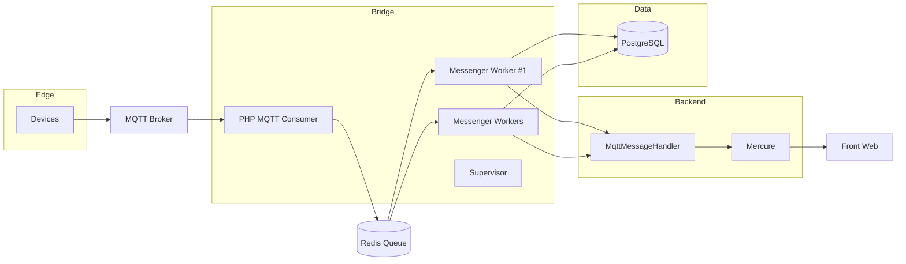
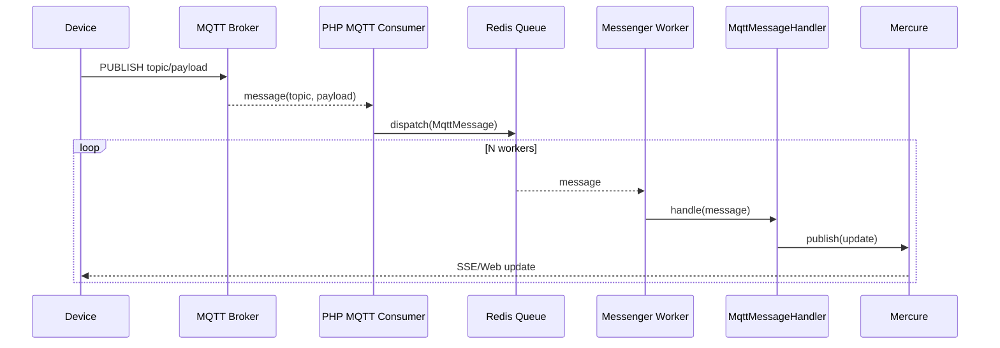

# Dataviz — Architecture d'infrastructure

Ce document résume l’architecture mise en place pour l’ingestion d’évènements MQTT, leur traitement asynchrone via Symfony Messenger, et la diffusion en temps réel via Mercure.

## Vue d’ensemble

- Broker MQTT (Mosquitto) pour la réception des messages IoT.
- Bridge MQTT (conteneur dédié) qui contient:
  - Un consommateur MQTT natif PHP (php-mqtt/client) long-vivant.
  - Plusieurs workers Messenger (`messenger:consume`) supervisés pour le traitement asynchrone.
  - Supervisor pour gérer et relancer les processus.
- Symfony (application): logique métier, handlers, publication vers Mercure.
- Redis: transport par défaut de Messenger (file `messages`).
- PostgreSQL: base applicative et transport d’échec (`failed`) de Messenger.
- Mercure: diffusion des mises à jour temps réel vers le front.

## Schéma (composants)



## Schéma (séquence d’un message)



## Fonctionnalités clés

- Ingestion MQTT native (php-mqtt/client) et dispatch asynchrone via Symfony Messenger (transport Redis).
- Workers parallèles supervisés (Supervisor) pour montée en charge.
- Publication temps réel via Mercure.
- Journalisation dédiée au bridge MQTT (canal `mqtt`).
- UI d’administration (ROLE_ADMIN):
  - CRUD Gateways.
  - Liste des Devices, vue détaillée avec Tags, filtre par Gateway.
- Front minimal: Turbo, Stimulus, Bootstrap chargés localement (AssetMapper).

## Déploiement & conteneurs

- `database` (PostgreSQL): variables `POSTGRES_DB`, `POSTGRES_USER`, `POSTGRES_PASSWORD`, volume `database_data`.
- `redis`: Redis 7 avec AOF activé (`--appendonly yes`), volume `redis_data`.
- `mqtt`: Mosquitto (broker), volumes `mosquitto_data`, `mosquitto_log`.
- `mqtt-bridge`:
  - Démarre `php /app/bin/mqtt-consumer.php` (consommateur MQTT natif).
  - Démarre `messenger:consume async` en plusieurs exemplaires (`WORKER_COUNT`).
  - Extensions PHP: `pdo_pgsql`, `redis`.
  - Lit sa config via variables d’environnement (voir ci-dessous).
- `mercure`: hub pour la diffusion temps réel.

## Configuration (env)

- MQTT (bridge): `MQTT_HOST`, `MQTT_PORT`, `MQTT_USERNAME`, `MQTT_PASSWORD`, `MQTT_TOPICS` (séparés par virgule ou espace), `MQTT_QOS`, `MQTT_TLS`, `MQTT_CLIENT_ID`.
- Messenger: `MESSENGER_TRANSPORT_DSN=redis://redis:6379/messages`.
- Base de données: `DATABASE_URL` (dans l’app), et `DATABASE_URL` injecté au bridge pour les workers (doctrine / transport failed).
- Workers (bridge): `WORKER_COUNT`, `CONSUME_TRANSPORTS` (défaut `async`), `CONSUMER_OPTIONS`.

## Interfaces Web (ROLE_ADMIN)

- Gateways
  - Index: `/gateways`
  - Nouveau: `/gateways/new`
  - Édition: `/gateways/{id}/edit`
- Devices
  - Index: `/devices`
  - Par gateway: `/devices/gateway/{id}` (filtré)
  - Détail: `/devices/{id}` (liste des tags du device)

Le menu d’accueil propose des liens vers Gateways et Devices. L’accès est restreint via `security.yaml` aux utilisateurs avec `ROLE_ADMIN`.

## Logs

- Canal dédié `mqtt` (Monolog):
  - Dev: `var/log/mqtt.log` (séparé de `var/log/dev.log`).
  - Prod: sortie `stderr` (JSON) pour intégration dans les pipelines de logs.
- Services taggés `mqtt`: `App\Mqtt\MqttConsumer`, `App\Service\MqttMessageHandler`.

## Formats topic & payload (MQTT)

- Topic attendu: `gateways/<gateway_id>/<device_id>`.
  - Actuellement, la recherche gateway se fait par `id` (entier) conformément au besoin en cours.
  - Le device est identifié/créé avec `Device.code = <device_id>` et rattaché à la gateway.

- Payload JSON attendu:

```
{
  "d": [
    { "tag": "AI.0", "value": 12.00 },
    { "tag": "AI.1", "value": 10 }
  ],
  "ts": "2017-12-22T08:05:20+0000" // optionnel
}
```

- Tolérance aux virgules terminales: le handler tente une “sanitization” (suppression des virgules finales avant `}` ou `]`) si le JSON est invalide, puis réessaie le décodage.

- Création/Mise à jour des Tags:
  - `Tag.code` = `d[i].tag`
  - `Tag.dataType` déduite de `d[i].value` → Postgres: int → `integer`, float → `double precision`, bool → `boolean`, string → `text`, array/object → `jsonb`, null → `text`.

## Création à la volée (Devices & Tags)


## Scalabilité & résilience

- Le bridge exécute plusieurs workers Messenger en parallèle (`WORKER_COUNT`).
- Le consommateur MQTT est long-vivant, gère la reconnexion et backoff simple.
- Redis sert de file performante en RAM avec persistance AOF (rejouée au redémarrage).
- Les messages en échec peuvent être routés vers le transport `failed` (PostgreSQL) pour inspection.

## Points d’amélioration possibles

- Partitionnement des topics (plusieurs consommateurs avec des filtres différents).
- QoS 1/2 selon besoins et latences acceptables.
- TLS + authentification côté MQTT et Redis (certificats/ACLs).
- Supervision/metrics: exporter la santé des workers et la profondeur des files.
